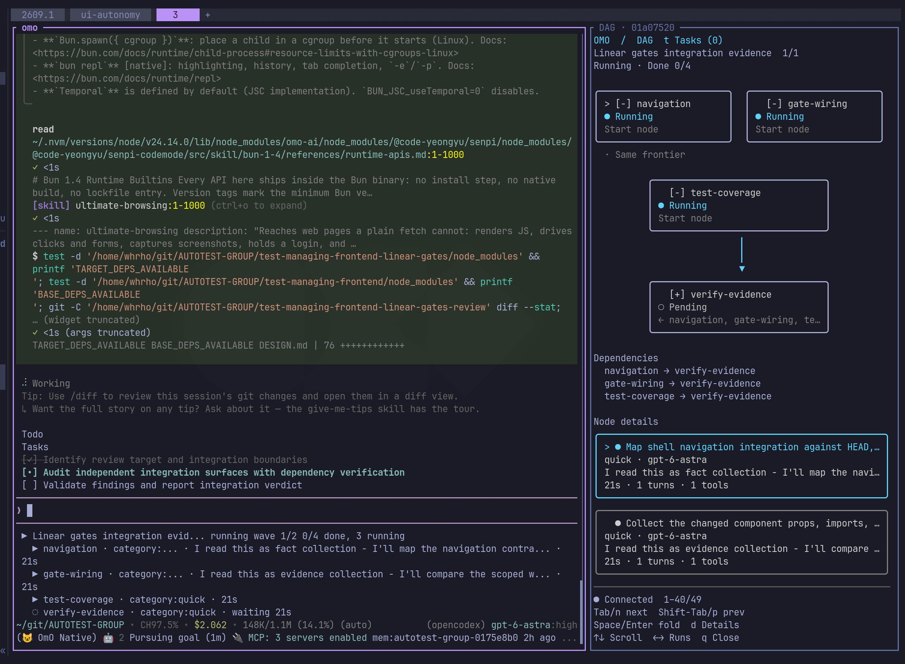
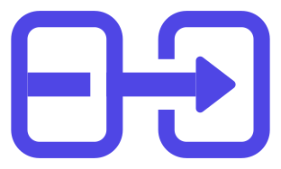
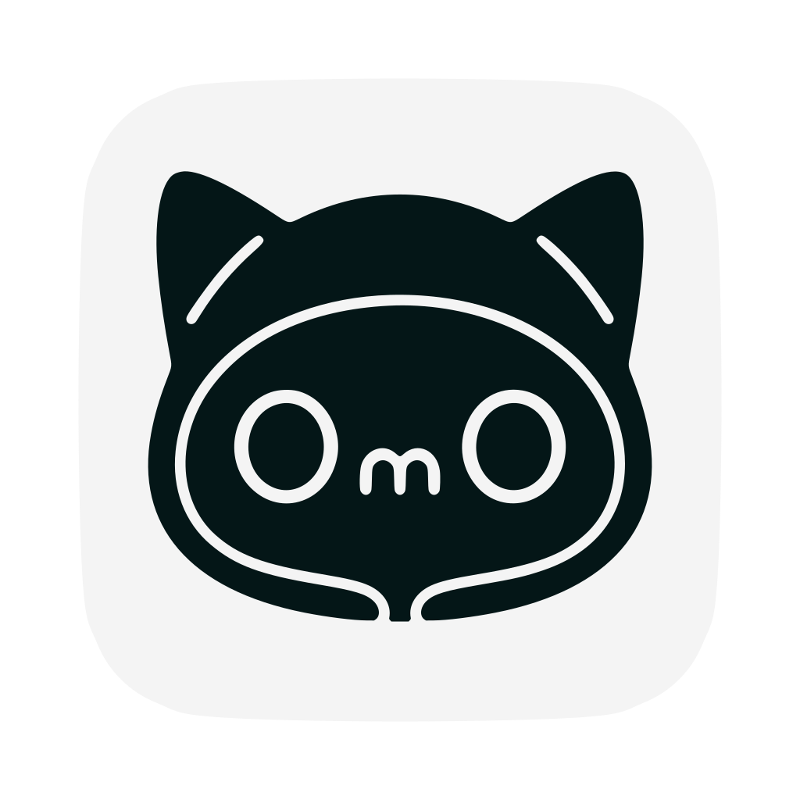

> [!NOTE]
> **OmO 测试版: OmO ❤️ Pi**
> 使用 `curl -fsSL https://get.omo.dev/install.sh | bash` 安装。记忆系统、CodeMode、Anthropic 订阅,全部支持。
> [](https://github.com/jc01rho/omo-herdr-dag)
> *只需在提示词中输入 "mass ulw" - 你就是图工程的大师。多模型 ultracode,搭配更出色的记忆系统。(右侧面板是 [omo-herdr-dag](https://github.com/jc01rho/omo-herdr-dag))*


> **Sponsors**
> 以下是我们的赞助商,支持着这个个人副业项目的持续开发。
> | [](https://opengateway.ai/) | **[OpenGateway](https://opengateway.ai/)** 赞助了 OmO。它是一个兼容 OpenAI 的网关,通过一个 API 即可使用多家模型提供商。感谢对开源的支持。 |
> | :-----| :----- |


> [!NOTE]
>
> [](https://sisyphuslabs.ai)
> > **OmO 由上述的 Jobdori 进行维护。认识你专属的 Jobdori, Dori。<br />[在此处](https://sisyphuslabs.ai)加入等待名单。**

> [!TIP]
> 加入我们！
>
> | [](https://discord.gg/PUwSMR9XNk) | 加入我们的 [Discord 社区](https://discord.gg/PUwSMR9XNk)，与贡献者及其他 OmO 用户交流。 |
> | :-----| :----- |
> | [](https://x.com/justsisyphus) | 关于 OmO 的更新过去发布在我的 X 账号上。<br /> 因为账号被意外停用，现在由 [@justsisyphus](https://x.com/justsisyphus) 代为发布更新。 |
> | [](https://github.com/code-yeongyu) | 在 GitHub 上关注 [@code-yeongyu](https://github.com/code-yeongyu) 获取更多项目信息。 |

<!-- <CENTERED SECTION FOR GITHUB DISPLAY> -->

<div align="center">

<a href="https://omo.dev"></a>

# OmO

**Your tool for real work. But it's an agent.**

[](https://github.com/code-yeongyu/oh-my-openagent/releases)
[](https://omo.dev)
[](https://github.com/code-yeongyu/oh-my-openagent/graphs/contributors)
[](https://github.com/code-yeongyu/oh-my-openagent/stargazers)
[](https://github.com/code-yeongyu/oh-my-openagent/blob/dev/LICENSE.md)
[](https://omo.dev/docs)

[English](README.md) | [한국어](README.ko.md) | [日本語](README.ja.md) | [简体中文](README.zh-cn.md) | [Русский](README.ru.md)

</div>

<!-- </CENTERED SECTION FOR GITHUB DISPLAY> -->

OmO 就是一个 `omo` 命令，把你的 token 变成真正完成的工作：上万个来源的研究、一看就懂的演示、后端、前端、编程。它运行在 senpi 上，这是我们基于 [pi](https://github.com/badlogic/pi-mono) 的分支，下面的一切都已内置。

## 安装

```bash
curl -fsSL https://get.omo.dev/install.sh | bash
omo
```

Windows 请在 PowerShell 中运行 `irm https://get.omo.dev/install.ps1 | iex`。脚本会为你的系统和 CPU 安装原生 `omo` 到 `~/.local/bin`，并用发布的校验和验证。想用包管理器的话，`bun add -g omo-ai`(或 `npm i -g omo-ai`)安装的是同一个 OmO。包名是 `omo-ai`；npm 上那个无关的 `omo` 包属于别人。Windows CMD、`PATH` 修复、更新和卸载见 [omo.dev/docs/install](https://omo.dev/docs/install)。

打开项目，运行 `omo`，说出要做的事。设置就这么多。

从 OpenCode 版或 LazyCodex 迁移过来？运行一次 `omo setup`。它会把你的提供商密钥、自定义提供商、MCP 服务器、技能和模型选择一并带过来。

之后运行 `omo doctor`，可以看到你的提供商能跑哪些任务类别，以及旧安装留下了什么。完整步骤见 [从 OpenCode 迁移](docs/guide/migrating-from-opencode.md)。

`omo update` 原地更新。`bun remove -g omo-ai`（或 `npm uninstall -g omo-ai`）即可卸载。

## 为什么选 OmO

**ultrawork。** 不必学习。觉得任务很难，就在提示词里加上 `ultrawork`（或 `ulw`）。

代理会先读代码库再动手，制定计划，每一步验证后再继续，在真实环境中检查结果，完成后停下。

**让数百个代理为你工作。只需一个关键词。** 输入 `mass ulw`，整件工作就变成一张代理图：横跨数千来源的深度研究、一整套机器学习流水线、没人想做的迁移。

每个部分由最合适的模型并行完成，说完成之前先经过检查。

**Kibitzer。你的代理不会忘记你，也不会忘记你的工作。** 记忆保存在一个由 markdown 文件组成的 git 仓库里。

一个小而便宜的模型坐在昂贵的主代理旁边，查看你做过的事，在主代理重蹈覆辙之前轻轻提醒。你不必反复解释自己。

**不用纠结的多模型。** 把你喜爱的前沿模型和便宜的模型混着用。登录即可：`/login` 支持 Claude、ChatGPT、Kimi 和 GLM 订阅。

每个模型都自带为它调好的系统提示词，你永远不会选错。

**高质量技能，只给你需要的那一点。** 你的模型很聪明，但解决现实问题时仍有很多不知道的事。

OmO 把缺失的知识做成技能，包括浏览器操作，只加载当前任务需要的部分。

**其余的一切都经过精心打造。** 彼此独立的工具调用放进一个小程序里一起执行，二十次读取只需一次往返。格式错误的工具参数在执行前被修好。

等待构建或部署是一种订阅，而不是轮询。长任务会记录检查过的内容，会话重启后从停下的地方继续。配置、技能、提示词实时重新加载。

## 配置

默认值自有主张，你坚持的话也可以调整。你的设置在 `~/.omo/omo.jsonc`，项目也可以添加自己的 `.omo/omo.jsonc`；离得最近的文件优先。

所有配置项见 [配置参考](docs/reference/configuration.md)。

## 文档

- [omo.dev/docs](https://omo.dev/docs)
- [从 OpenCode 迁移](docs/guide/migrating-from-opencode.md)
- [配置参考](docs/reference/configuration.md)
- [功能](docs/reference/features.md)
- [电脑操作](docs/guide/computer-use.md)（实验性功能）
- [Ultrawork 宣言](docs/manifesto.md)

## 评价

> "It made me cancel my Cursor subscription. Unbelievable things are happening in the open source community." - [Arthur Guiot](https://x.com/arthur_guiot/status/2008736347092382053?s=20)

> "If Claude Code does in 7 days what a human does in 3 months, OmO does it in 1 hour." <br/>- B, Quant Researcher

> "You guys should pull this into core and recruit him. Seriously. It's really, really, really good." <br/>- Henning Kilset

## 作者的话

如果我不得不从代理手里把方向盘拿回来，那不是团队协作，而是系统失败了。OmO 就建立在这个理念之上。

你说出想要什么；代理负责研究、规划，写出与资深工程师难以区分的代码，验证它，一直推进到完成。它在能换来真正速度时才花 token，把简单的部分交给便宜的模型。

我是这个项目最着迷的用户。哪个模型逻辑最敏锐？谁的文字写得最好？这周别人都发布了什么？这些答案最终都落在 OmO 里。有更好的办法？欢迎 PR。

目标是一个你不再察觉到的代理。按下开关，灯就亮了。完整版本见 [Ultrawork 宣言](docs/manifesto.md)。

与文中提到的任何项目或模型均无关联。Ultragoal 和 UltraQA 的思路来自 [oh-my-codex](https://github.com/Yeachan-Heo/oh-my-codex)，并按其概念为 OmO 重新实现。

## 这些公司的专业人士在用

[Indent](https://indentcorp.com), makers of Spray (influencer marketing solution), vovushop (cross-border commerce platform) and vreview (AI commerce review marketing solution). [Google](https://google.com). [Microsoft](https://microsoft.com). [Vercel](https://vercel.com). [ELESTYLE](https://elestyle.jp), makers of elepay (multi-mobile payment gateway) and OneQR (mobile application SaaS for cashless solutions). [Deepgram](https://deepgram.com).
